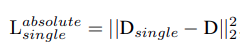
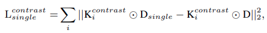

# Proposed loss for face anti spoofing

This documents aims to summarize the depth loss proposed by Zezheng Wang, Chenxu Zhao, Yunxiao Qin, Qiusheng Zhou, Guojun Qi, Jun Wan, Zhen Lei in their paper: *Exploiting temporal and depth information for multi-frame face anti-spoofing*

```bash
                                   ----------
A single (256x256x3) RGB Image -> |   CDCN   | -> A 32x32 Depth Map
                                   ----------
```

Depth loss consists of 2 parts:
1. Squared Euclidean norm loss between predicted depth map and ground truth depth map



2. Contrastive depth loss  

